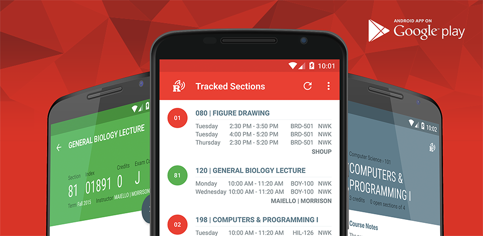

Course Tracker - Android [](https://travis-ci.org/tevjef/uct-android)
======================

<p align="center">
    <a href="https://play.google.com/store/apps/details?id=com.tevinjeffrey.rutgersct"></a>
</p>

## What is Rutgers Course Tracker?
In short, Rutgers Course Tracker (RCT) allows users to view courses and subscribe to their openings. Inspired by Abe Stanway's [Schedule Sniper](http://abe.is/a/sniper/) and Vaibhav Verma's python [Sniper](https://github.com/v/sniper). 

Additionally, users can view information about current and upcoming semesters. This includes prerequisites, course specific information and even professor ratings and details.
Once a section of course is tagged to be tracked, the app checks for openings at user selectable interval.

## Motivations?
I started this project on January 14th 2015 out of desperation. Other "course sniping" solutions out there are focused on the New Brunswick campus, leaving me with very few options. In a few days I threw together something simple and it worked quite well. I began work on a full version and within a few weeks it was stable and presentable enough to be my first app on the Google Play Store.

## How was it made?
RCT was developed in my spare time using <a href="https://developer.android.com/sdk/index.html">Android Studio</a> and <a href="https://www.jetbrains.com/idea/">Intellij 14.04</a>. It was designed to take advantage of the <strong>Model-View-Presenter (MVP)</strong> architectural pattern which enabled me to create a robust, extensible and testable code base.

I owe the speed at which I developed the application to <a href="https://github.com/tevjef/Rutgers-Course-Tracker/blob/master/app/build.gradle">many open source libraries</a>. Each one of them likely saved me from days of headaches, debugging and testing. 3 of them in particular, <strong>RxJava</strong>, <strong>Retrofit</strong> and <strong>Dagger</strong>, greatly simplified my business code and reduced some very complex logic to child's play. I highly recommend using any of these libraries in you own applications.

## Requirements

- [Android SDK](http://developer.android.com/sdk/index.html).
- Android [8.1 (API 27) ](http://developer.android.com/tools/revisions/platforms.html#8.0).
- Android SDK Tools (Gradle 3.0+)
- Android SDK Build tools 26.0.2
- MinSdkVersion 19

## Libraries

The libraries and tools used include:

- Android Support Library 27
- Android Architecture Components (Room, LiveData, ViewModel)
- Firebase (Analytics, Messaging, Performance, Crash Reporting)
- [RxJava 2](https://github.com/ReactiveX/RxJava) and [RxAndroid](https://github.com/ReactiveX/RxAndroid)
- [Retrofit 2](http://square.github.io/retrofit/) and [OkHttp](https://github.com/square/okhttp)
- [Dagger 2](http://google.github.io/dagger/)
- [Timber](https://github.com/JakeWharton/timber)
- [Wire](https://github.com/square/wire) and [wire-gradle-plugin](https://github.com/jiechic/wire-gradle-plugin)
- [AppIntro](https://github.com/PaoloRotolo/AppIntro)
- [Once](https://github.com/jonfinerty/Once)
- [IcePick](https://github.com/frankiesardo/icepick)
- [Material Dialogs](https://github.com/afollestad/material-dialogs)

and [more...](https://github.com/tevjef/Rutgers-Course-Tracker/blob/master/app/src/main/res/raw/open_source_licenses.json)

# Licence

```
Copyright 2017 Tevin Jeffrey.

Licensed under the Apache License, Version 2.0 (the "License");
you may not use this file except in compliance with the License.
You may obtain a copy of the License at

    http://www.apache.org/licenses/LICENSE-2.0

Unless required by applicable law or agreed to in writing, software
distributed under the License is distributed on an "AS IS" BASIS,
WITHOUT WARRANTIES OR CONDITIONS OF ANY KIND, either express or implied.
See the License for the specific language governing permissions and
limitations under the License.
```

